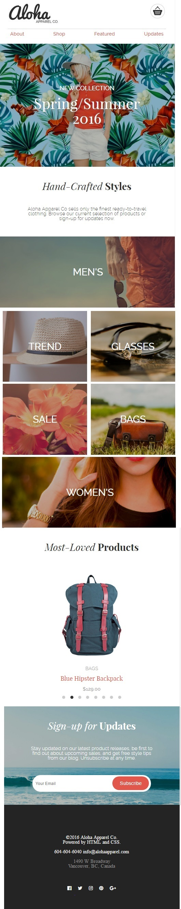

Synopsis

  Thematically this is a front page for am imaginary hawaiian-esque clothing company's website, with stylized menus and product listings. intended to display basic HTML, CSS and even a few JS and jQuery skills

This is my first project in the webdev cohort for RED Academy, in Vancouver. We were given an image of a site, basic html and css skills and set loose trying to duplicate it. In the coming weeks, we were taught better methods for building a reactive, well coded site utilizing flexbox to improve positioning across multiple screen sizes. I believe that this is useful because it shows how tech developments over time will force revisions of our code to stay current and "with the times". 

---------Tech Used-----------
-HTML
-CSS
-JavaScript, mostly involving jquery
-Flickety
-Font Squirrel

# h1
## h2
### h3
#### h4

Paragraph

- item 1
- item 2
- item 3

1. one
2. two
3. three

